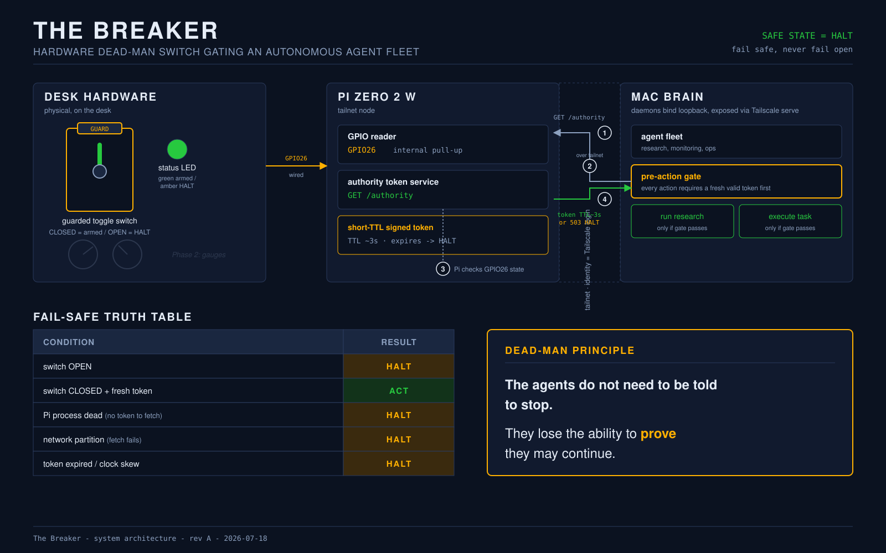
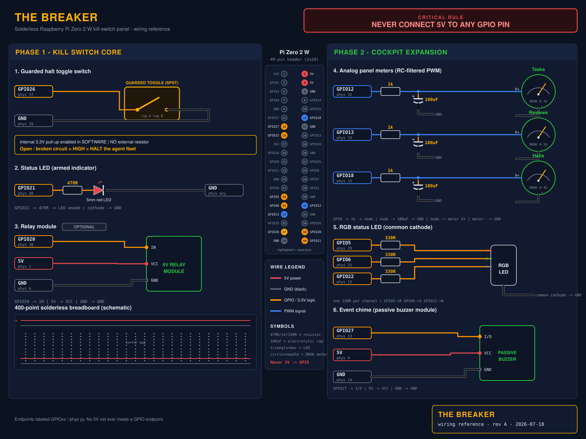
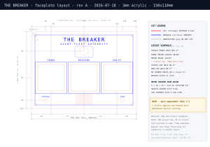

# The Breaker

**A physical dead-man kill-switch for an autonomous AI agent fleet.**

I run a small fleet of AI agents on my Mac that handle research, monitoring, and operational busywork. They work while I sleep. Software has an off switch only as long as the software cooperates, so I designed The Breaker: a desk panel where a guarded missile switch decides whether the agents are allowed to act at all.

The agents are never *told* to stop. They quietly lose the ability to prove they are still allowed to run. **The default state is stop.**

> **Status:** design of record complete and audited (Phase 1 BOM $41.59). Parts not yet ordered; the authority-token service and agent-side gate are the next build. This repo is the hardware design; the working build and demo video follow.

🔗 [Follow the build on LinkedIn](https://www.linkedin.com/in/tarang-tj) · [More projects](https://github.com/tarang-tj) · [Live design page](https://tarang-tj.github.io/the-breaker/)

---

## How it works

A guarded toggle on the desk feeds a Raspberry Pi Zero 2 W (a node on my private Tailscale network). The Pi serves a short-TTL "authority token" over HTTP on the tailnet. Every agent must fetch a fresh token before every action. Let the token lapse and the agent simply can't act.

The safe state is **HALT everywhere** — it is reached by *loss*, not by a command, so anything that breaks the chain fails safe.

| Condition | Result |
|---|---|
| Switch OPEN | **HALT** |
| Pi process dead (no token to fetch) | **HALT** |
| Network partition (fetch fails) | **HALT** |
| Token expired / clock skew | **HALT** |
| Switch CLOSED + fresh token | ACT |

This is the dead-man principle from rail and heavy machinery, applied to software agents: authority is something the system must continuously *prove it still holds*, not something you have to remember to revoke.

## Wiring

Solderless, two-wire safety core. `GPIO26` to ground with the Pi's internal pull-up in software; an open or broken circuit reads HIGH = HALT. 5V never touches a GPIO pin.

See [`hardware/gpio-map.md`](hardware/gpio-map.md) for the full pin map.

## Faceplate

3mm laser-cut acrylic, 150x110mm, cut at the UW Bothell makerspace. Phase 2 adds three analog gauges reading live agent-activity metrics (tasks, reviews, halts), an RGB status LED, and an event chime.

## Bill of materials

Phase 1 gets a working bench demo for **$41.59**. Both phases land around **$106-125**, under a $200 cap. Full itemized list in [`hardware/bom.md`](hardware/bom.md).

| Phase 1 core | Est. |
|---|---|
| Raspberry Pi Zero 2 W (pre-soldered headers) | $15.00 |
| Guarded missile toggle switch | $8.00 |
| SanDisk Ultra 32GB microSD | $7.99 |
| 400-point solderless breadboard | $3.00 |
| Female-female Dupont jumpers (40-pack) | $5.00 |
| 5mm red LED + 470Ω resistor | $0.60 |
| Pre-crimped female spade connectors (x4) | $2.00 |
| **Core subtotal** | **$41.59** |

## Design deck

The full nine-slide design reveal is in [`design/the-breaker-design-reveal.pdf`](design/the-breaker-design-reveal.pdf), and the individual slides are in [`slides/`](slides/).

## Why I built it

Agent oversight is moving from a research talking point to an engineering problem: if you let software act on your behalf, you want a control you can reason about physically. The Breaker is my take on that — a fail-safe you can see, flip, and trust, designed so that every failure mode I could think of lands on HALT.

---

*Design generated with help from a hardware draft tool, then hand-audited end to end (the auto-generated BOM had duplicate and phantom parts; this list is the corrected one). Renders and diagrams are my own.*
